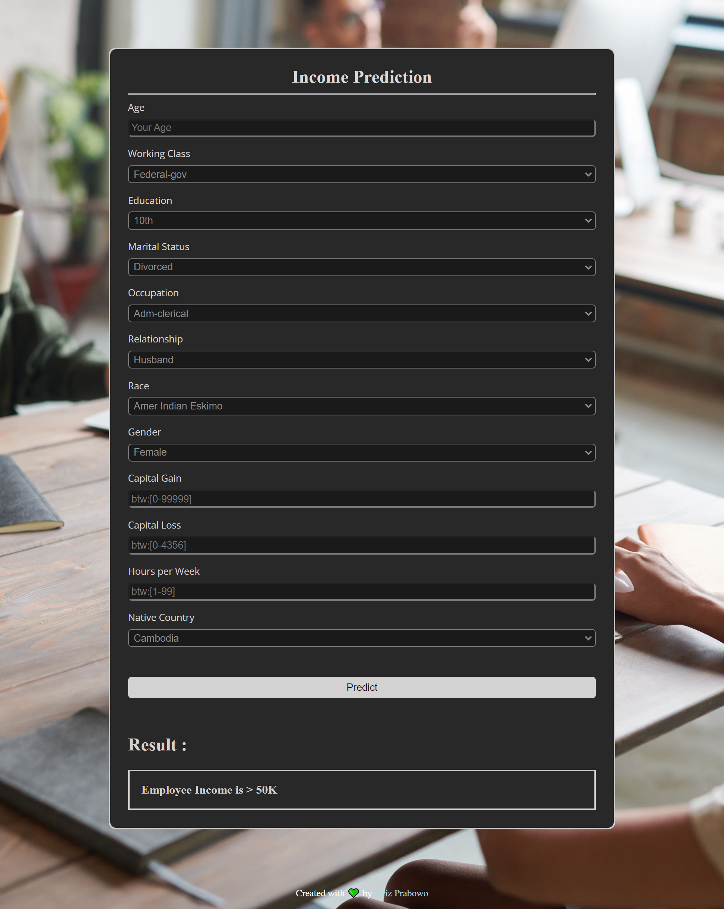

# Income Prediction

This is a machine learning model that utilizes the AdaBoost algorithm to predict income based on various attributes such as age, workclass, education, marital status, and more. By training on a dataset containing these features, the model can classify individuals into different income categories.

In addition, this project also includes a web application that has been deployed on the Heroku platform. The web application allows users to input their information, such as age, education level, occupation, and other attributes, and obtain predictions on their income level. The application is built using Flask, a popular Python web framework, which provides a user-friendly interface for interacting with the deployed model.

- Deployment Page : [Income Predictor](https://income-prediction-flask-deploy.herokuapp.com/)

## Screenshot

